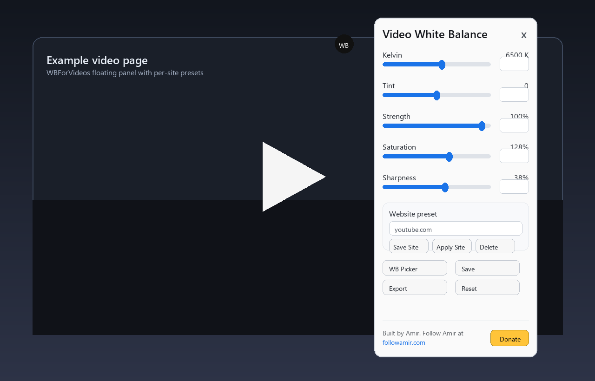

# WBForVideos

WBForVideos is a Violentmonkey/Tampermonkey userscript for tuning HTML5 video color directly in the browser.

It adds a draggable `WB` launcher on pages with video. Open the panel to tune white balance, tint, brightness, contrast, saturation, sharpness, highlights, midtones, shadows, and a tone curve.

## Features

- Kelvin white balance from `500 K` to `100,000 K`.
- Tint and strength controls.
- Brightness, contrast, saturation, and sharpness controls.
- Highlights, midtones, shadows, and a tone curve for finer grading.
- White-balance picker for choosing a neutral point from the video.
- Searchable history for saved video and site settings.
- Compare split for checking adjusted vs original video.
- Per-video saves.
- Per-website presets, such as one preset for YouTube and another for another video site.
- JSON import/export for moving presets between browsers.
- Draggable launcher with a direct video / iframe target badge.
- Fullscreen stability handling for difficult embedded players, including Animepahe and Fulltaboo-style nested frames.
- Small `Built by Amir` footer with `followamir.com` and Donate links.

## Install

1. Install [Violentmonkey](https://violentmonkey.github.io/) or Tampermonkey in a Chromium browser.
2. Open the raw userscript:

   <https://github.com/AmirMDEV/WBForVideos/raw/main/WBForVideos.user.js>

3. Confirm the install in your userscript manager.

## Basic Use

1. Open a page with a video.
2. Click the `WB` bubble.
3. Adjust the sliders.
4. Use `Save Site` to make the settings apply automatically on the current website.
5. Use `Save` when you want a preset for only the current video.

Example: on YouTube, you might increase saturation and sharpness, type `youtube.com` in Website preset, and click `Save Site`.

## Privacy Notes

This script runs on all sites because it is designed to work with videos wherever they appear.

The script stores settings in your browser userscript storage. Per-video saves can include the current page origin, path, and query string. Website presets store hostnames such as `youtube.com`. JSON exports contain those saved keys, so review exported files before sharing them.

The script does not send your presets to any server.

## Permissions

- `GM_getValue` / `GM_setValue`: save settings and presets.
- `GM_download`: export settings JSON.
- `GM_registerMenuCommand`: add the show/hide panel command.
- `GM_addStyle`: add isolated page styles for the video filter.
- `@allFrames true`: support embedded video players inside iframes.

## Links

- Follow Amir: <https://followamir.com/>
- Donate: <https://www.paypal.com/donate/?hosted_button_id=2U2GXSKFJKJCA>
